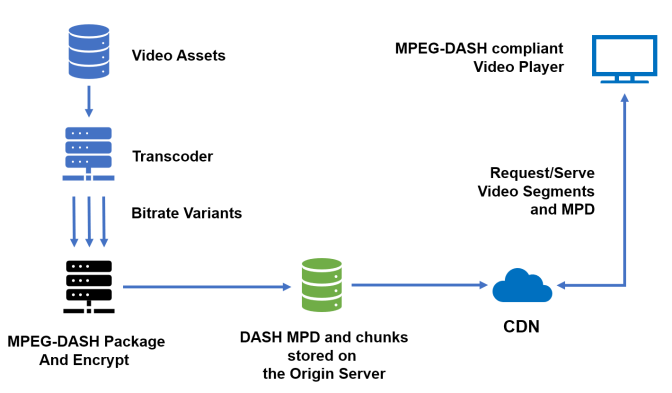

Types of Video Streaming
1. On-Demand
    - Protocols
        - HTTP Streaming (HLS)
        - DASH - Dynamic Adaptive Streaming over HTTP
2. Live
    - Protocols
        - RTMP - Real Time Messaging Protocol
        - DASH - Dynamic Adaptive Streaming over HTTP

ABS - Adaptive Bitrate Streaming (DASH supports it)

